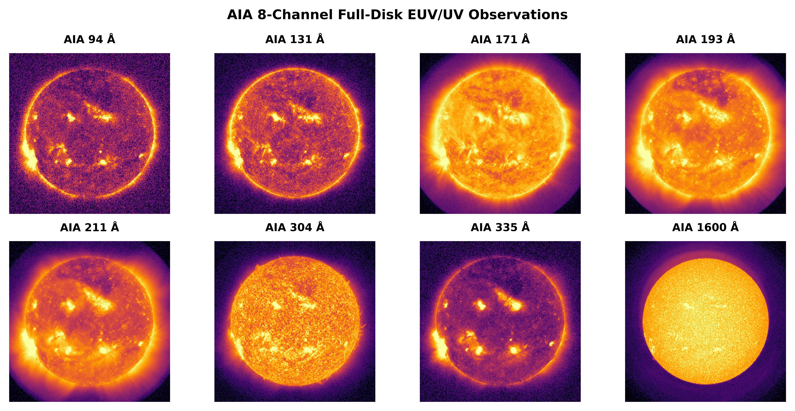
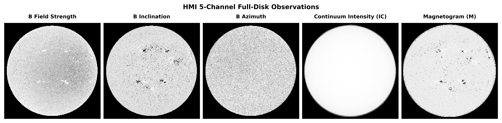

# FlareEUV: Multimodal Solar EUV Forecasting using Deep Learning

This repository contains the implementation for **FlareEUV**, a deep learning framework for predicting post-flare solar EUV irradiance using multimodal solar observations from **SDO/AIA** and **SDO/HMI**.

This work was developed for the **ICMLA 2026 conference submission**.

-- 

## Solar Observations

### AIA EUV Channels

Atmospheric Imaging Assembly (AIA) observations across eight EUV and UV wavelengths used as input channels for the model.

### HMI Magnetic Field Observations

Helioseismic and Magnetic Imager (HMI) observations showing magnetic field strength, inclination, azimuth, continuum intensity, and magnetogram.

---

## Overview

Solar flares significantly alter the solar EUV spectrum and affect Earth's ionosphere and space weather environment. Forecasting EUV irradiance after major solar flares is important for understanding and predicting space weather impacts.

This project introduces a deep learning pipeline that predicts EUV irradiance evolution over three days following a flare using solar imaging data.

The model uses:

- **AIA (Atmospheric Imaging Assembly)** EUV/UV observations  
- **HMI (Helioseismic and Magnetic Imager)** magnetic field observations  

to predict EUV irradiance at:

- **T₀** (flare time)  
- **T₊₁ day**  
- **T₊₂ days**

---

## Dataset

The dataset contains **33 major solar flares** observed between **2011–2014**.

### AIA Channels (8)

- 94 Å
- 131 Å
- 171 Å
- 193 Å
- 211 Å
- 304 Å
- 335 Å
- 1600 Å

### HMI Channels (5)

- Magnetic field strength
- Magnetic inclination
- Magnetic azimuth
- Continuum intensity
- Line-of-sight magnetogram

Total channels per sample:
13 channels

Each input sample has shape:
13 × 256 × 256

---

## Targets

Targets are derived from **SDO/EVE Level-3 EUV spectral irradiance data (6.5 nm)**.

For each flare, the model predicts:
EUV_T0
EUV_T1
EUV_T2

representing irradiance at:

- flare time  
- 1 day after flare  
- 2 days after flare  

---

## Data Acquisition

Solar observations were downloaded from **JSOC (Joint Science Operations Center)** using **SunPy Fido**.

For each flare we collect observations at the following offsets:
-24h
-18h
-12h
-6h
0h

To avoid **temporal leakage**, the +6h observation is excluded during model training.

Images are:

- normalized using percentile clipping and log stretch
- resized to **256×256**
- stored as compressed **NPZ tensors**

---

## Repository Structure
flare-euv-forecasting
│
├── notebooks
│ ├── aia_download.ipynb
│ ├── hmi_download.ipynb
│ ├── preprocessing.ipynb
│ ├── target_generation.ipynb
│ └── model_training.ipynb
│
├── figures
│
├── artifacts
│
├── flare_euv_targets_3day.csv
│
├── README.md
└── requirements.txt

---

## Method

The pipeline consists of:

1. **Data acquisition**
   - download AIA and HMI observations from JSOC

2. **Preprocessing**
   - normalization
   - log intensity scaling
   - spatial resizing
   - temporal aggregation

3. **Dataset construction**
   - stack AIA and HMI channels

4. **Model training**
   - CNN / ResNet architectures
   - multimodal feature fusion

5. **Evaluation**
   - Leave-One-Flare-Out cross-validation

---

## Models

Experiments include multiple architectures:

- CNN baseline
- Tiny CNN
- ResNet34
- Improved ResNet with channel attention

The models predict EUV irradiance using **multichannel solar imagery**.

---

## Evaluation

Model performance is evaluated using:

- **Mean Absolute Error (MAE)**
- **Pearson Correlation**
- **R² score**

using **Leave-One-Flare-Out (LOFO)** cross-validation.

---

## Installation

Clone the repository:
git clone https://github.com/Sathvik2199/flare-euv-forecasting.git

cd flare-euv-forecasting

Install dependencies:
pip install -r requirements.txt

---

## Data

Due to repository size limits, raw solar data files (`FITS`, `NPZ`, `NPY`) are not included.

The notebooks in this repository allow reproduction of the dataset by downloading observations directly from JSOC.

---

## Dependencies

Main libraries used:

- Python
- PyTorch
- NumPy
- Pandas
- SunPy
- Astropy
- OpenCV
- Matplotlib
- Scikit-learn

---

## Author

**Sathvik Soman**

GitHub:  
https://github.com/Sathvik2199